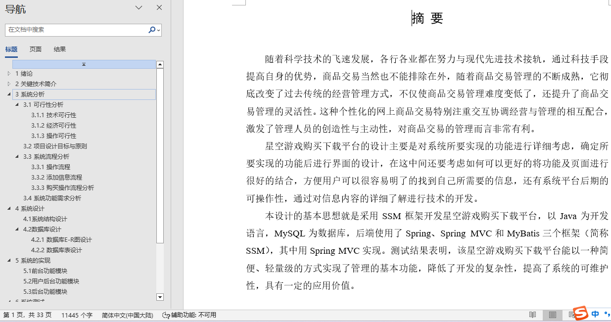
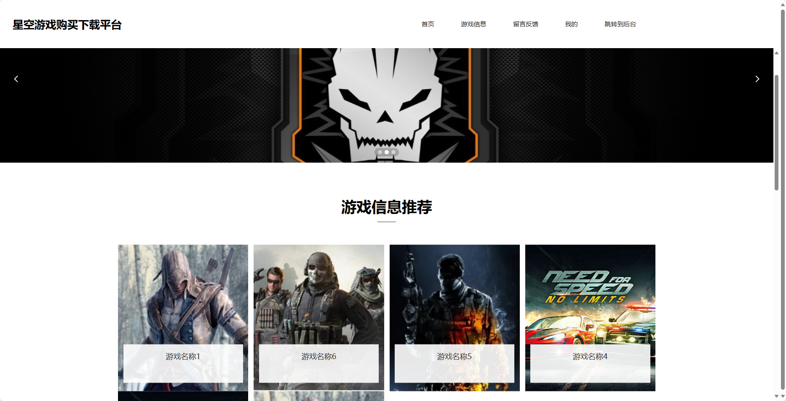
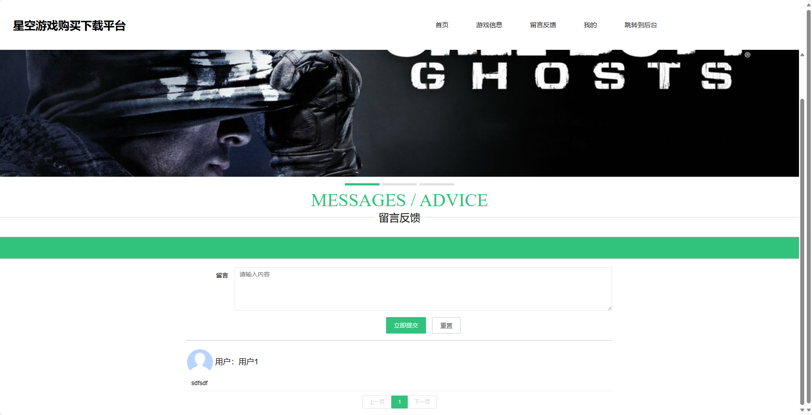
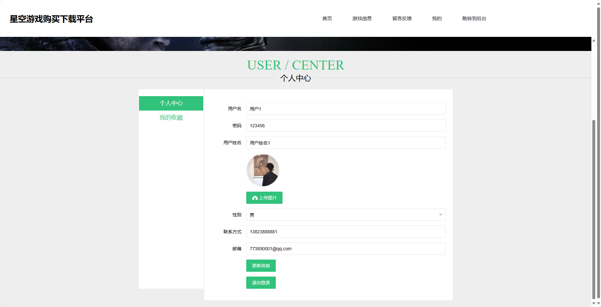
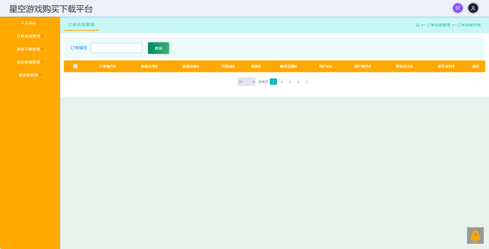
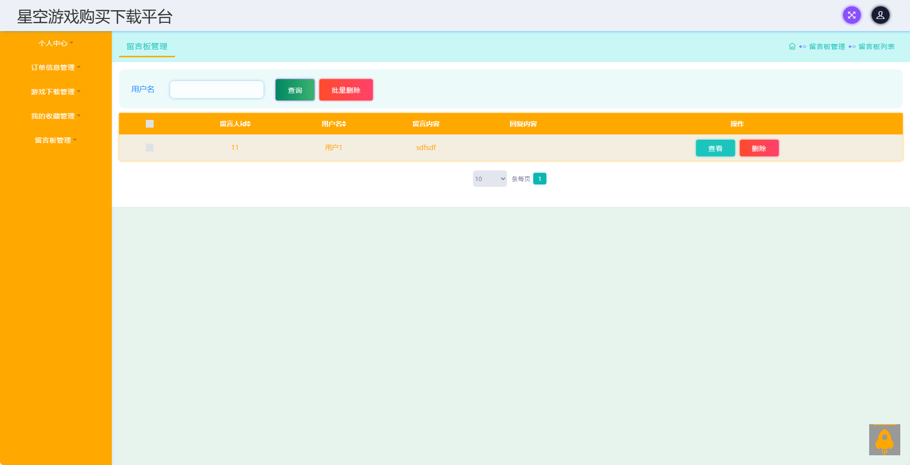
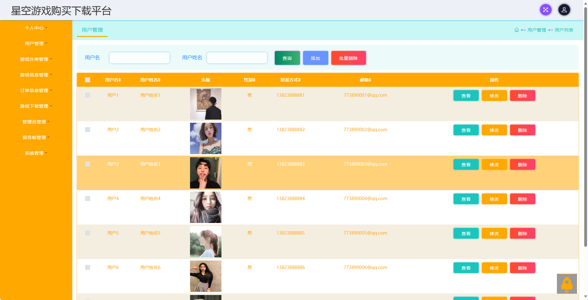
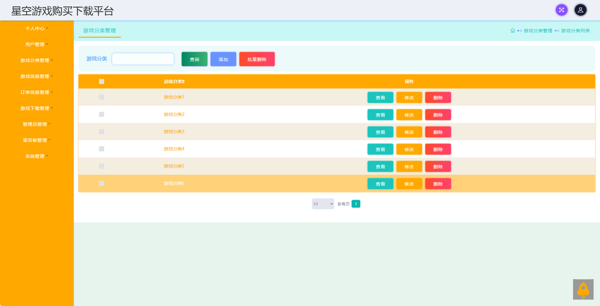
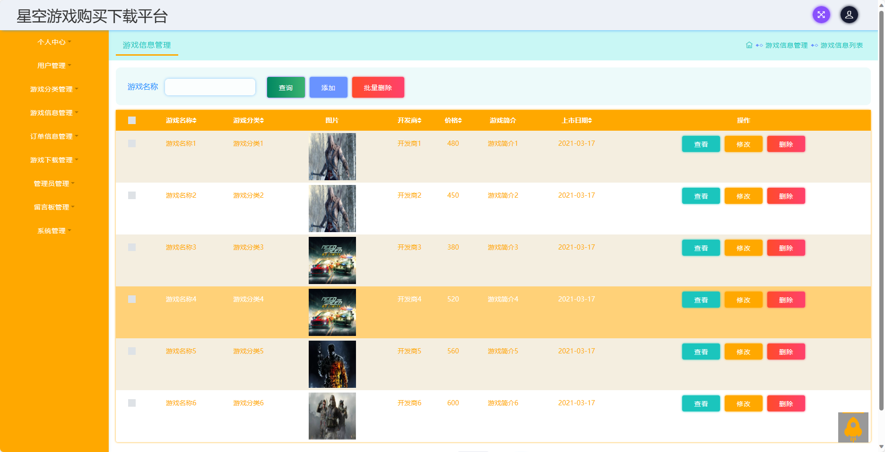
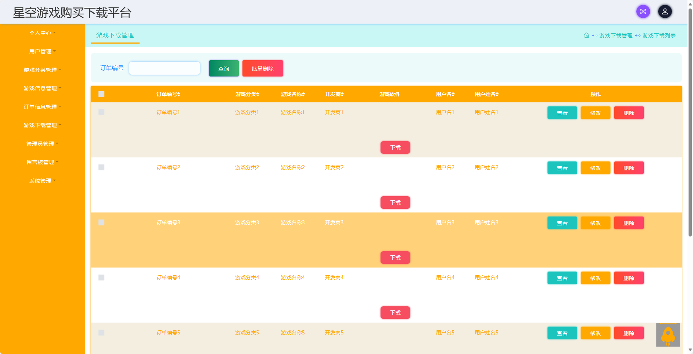

## 基于SSM框架实现的星空游戏购买下载平台(程序+报告)

- <b>完整代码获取地址：从戎源码网 ([https://armycodes.com/](https://armycodes.com/))</b>
- <b>技术探讨、资料分享，请加QQ群：692619798</b> 
- <b>作者微信：19941326836  QQ：952045282</b> 
- <b>承接计算机毕业设计、Java毕业设计、Python毕业设计、深度学习、机器学习</b>
- <b>选题+开题报告+任务书+程序定制+安装调试+论文+答辩ppt 一条龙服务</b>
- <b>所有选题地址 ([https://github.com/YuLin-Coder/AllProjectCatalog](https://github.com/YuLin-Coder/AllProjectCatalog)) </b>

## 项目介绍
基于SSM框架实现的星空游戏购买下载平台，系统包含两种角色：管理员、用户,系统分为前台和后台两大模块，主要功能如下。

前台-【用户】：
1. 首页：展示星空游戏购买下载平台的基本信息和推荐游戏，提供快捷入口和搜索功能，方便用户浏览和查找感兴趣的游戏。
2. 游戏信息：提供游戏的详细信息和介绍，包括游戏名称、开发商、游戏类型、评分等，让用户了解游戏的特点和玩法。
3. 留言反馈：用户可以在留言板上发布游戏的评论、建议和问题，与其他用户进行交流和分享游戏心得。
4. 我的：用户可以注册账号并登录，查看个人信息和购买记录，管理收藏、留言等操作，方便用户个人信息和游戏记录的管理和查看。

后台-【管理员】：
1. 个人中心：管理员可以登录系统后台，查看个人信息和管理账号相关设置。
2. 用户管理：管理员可以管理用户信息，包括查看用户列表、编辑用户信息、冻结用户账号等操作，维护用户数据的完整性和安全性。
3. 游戏分类管理：管理员可以管理游戏的分类信息，包括添加、修改和删除游戏分类，确保游戏的分类清晰和规范。
4. 游戏信息管理：管理员可以管理游戏的详细信息和介绍，包括添加、修改和删除游戏信息，确保游戏信息的准确性和完整性。
5. 订单信息管理：管理员可以管理用户的购买订单，包括查看订单列表、处理退款、确认订单等操作，维护订单的准确性和及时处理用户的购买需求。
6. 游戏下载管理：管理员可以管理游戏的下载链接和版本信息，包括添加、修改和删除游戏下载链接，确保游戏下载的顺畅和安全。
7. 管理员管理：管理员可以管理其他管理员的账号和权限，包括添加、修改和删除管理员账号，确保系统管理员的合理和安全。
8. 留言板管理：管理员可以管理用户在留言板上的评论和留言，包括审核、删除和置顶评论，维护留言板的秩序和内容质量。
9. 系统管理：管理员可以管理系统的设置和配置，包括网站基本信息的修改、系统日志的查看等，确保系统的正常运行和安全性。

## 项目技术
- 编程语言：Java
- 数据库：MySQL
- 前端技术：JSP、JavaScript、jquery
- 后端技术：Spring、SpringMVC、MyBatis

## 运行环境
- JDK版本：JDK1.8及以上
- 开发工具：IDEA、Ecplise、Myecplise都可以
- 数据库: MySQL5.7及以上

## 运行截图

